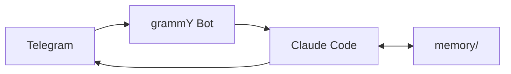

  

<h1 align="center">Hamid</h1>

<table>
<tr>
<td>

A personal AI agent that runs locally. Claude Code sessions bridged to Telegram, with scheduled automations, a permission engine, and persistent memory. Everything stays on your machine.

Hamid is a framework for running a persistent AI agent on your Mac. You talk to it through Telegram. It talks back through Claude Code.

Hamid spawns Claude Code sessions in your workspace, with a personality you define (`SOUL.md`), project instructions it follows (`CLAUDE.md`), and memory it writes to disk so the next session isn't starting from zero.

</td>
<td>

</td>
</tr>
</table>

## What it does

- **Telegram bridge** — Send messages (text or voice) to your Telegram bot. Hamid spawns a Claude Code session, streams the response back, and keeps the session alive. Follow-up messages resume the same conversation, so context carries across messages without burning a new session each time.

- **Persistent memory** — Hamid writes daily notes and a running context file. Each session reads these back, so it knows what you were working on yesterday, what your preferences are, and what decisions were already made.

- **Scheduled automations** — launchd jobs that run on a schedule and message you on Telegram

- **Permission engine** — Controls what Claude Code is allowed to do. Bash commands, file access, MCP tools — all gated by configurable patterns.

- **Skills** — Reusable workflows defined as markdown files in `.claude/skills/`. Claude Code reads them when a task matches.

## How it works

## Heads up

Every message you send and every scheduled automation spawns a Claude Code session. With several automations running daily, usage adds up fast. Keep an eye on your Claude Code / API usage, especially while tuning schedules.

## Getting started

See **[docs/SETUP.md](docs/SETUP.md)** for the full setup guide.

## License

MIT
